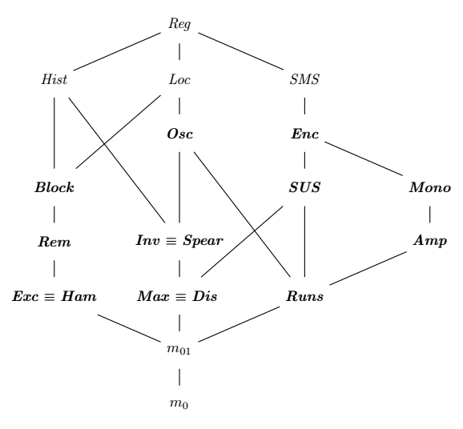

The finest test page to ever be, I sure hope you like it.

This is mostly copy-pasted from other projects to ensure that things render correctly.

Hello from Codeberg!

Well, ehllo there beautiful :3

Silly, you made a typo :p

## Measures of presortedness

*Measures of presortedness* are a specific category of *measures of disorder* formally defined by Heikki Mannila in *Measures of presortedness and optimal sorting algorithms*:

> Given two sequences $X$ and $Y$ of distinct elements, a measure of presortedness *M* is a non-negative integer function that satisfies the following properties:
>
> 1. If $X$ is sorted, then $M(X) = 0$
> 2. If $X$ and $Y$ are order isomorphic, then $M(X) = M(Y)$
> 3. If $X$ is a subsequence of $Y$, then $M(X) ≤ M(Y)$
> 4. If $X \le Y$, then $M(XY) ≤ M(X) + M(Y)$
> 5. $M(⟨e⟩X) ≤ \lvert X \rvert + M(X)$ for every element $e$ of the domain

### Adaptive algorithms and measures of presortedness

*Measures of presortedness and optimal sorting algorithms* also defines what it means for a sorting algorithm to be $M$-optimal or $M$-adaptive with regard to a measure of presortedness $M$. We first need a few definitions.

Let $X$ be a sequence of elements, and let $S_X$ be set of all permutations of that sequence:

$$\mathit{below}_M(X) = \{ \pi \vert \pi \in S_X \text{ and } M(\pi) \le M(X) \}$$

Let $T_S(X)$ be the number of steps needed for an algorithm $S$ to sort $X$. A sorting algorithm is said to be $M$-optimal if and only if, for some constant $c$, we have for all $X$:

$$T_S(X) \le c \cdot max\{\lvert X \rvert, \log{} |\mathit{below}_M(X)|\}$$

In other words, a sorting algorithm is considered $M$-optimal if it takes a number of steps that is within a constant factor of the lower bound of $M$ to sort a sequence. For example a $\mathit{Rem}$-optimal algorithm should be able to sort any sequence in $O(\lvert X \rvert \log{} \mathit{Rem}(X))$ steps.

### Partial ordering of measures of disorder

Early on, authors have been wanting to prove that some measures of disorder were "better" than other, though it quickly appeared that just comparing the raw numbers by the measures was not enough. Alistair Moffat proposed the following intuitive definition in *Ranking measures of sortedness and sorting nearly sorted lists*:

> Let $M_1$ and $M_2$ be two measures of disorder:
>
> * $M_1$ is algorithmically finer than $M_2$ (denoted $M_1 \le_\mathit{alg} M_2$) if and only if any $M_1$-optimal sorting algorithm is also $M_2$-optimal.
> * $M_1$ and $M_2$ are algorithmically equivalent (denoted $M_1 =_\mathit{alg} M_2$) if and only if $M_1 \le_\mathit{alg} M_2$ and $M_2 \le_\mathit{alg} M_1$.

While useful to understand what we want from a partial order on measures of disorder, the definition above does not help a lot when it comes to actually proving that a measure is algorithmically finer than another. To better compare two measures of disorder, Jingsen Chen introduces the following operator in *Computing and ranking measures of presortedness*:

> Let $M_1$ and $M_2$ be two measures of disorder:
>
> * $M_1$ is superior to $M_2$ (denoted $M_1 \preceq M_2$) if and only if there exists a constant $c$ such as $\lvert \mathit{below}_{M_1}(X) \rvert \le c \cdot \lvert \mathit{below}_{M_2}(X) \rvert$ for any sequence $X$.
> * $M_1$ and $M_2$ are equivalent (denoted $M_1 \equiv M_2$) if and only if $M_1 \preceq M_2$ and $M_2 \preceq M_1$.

That definition seems to match the one proposed much earlier by Alistair Moffat and Ola Petersson in *A Framework for Adaptive Sorting*, though the authors use the symbol $\supseteq$ instead of $\preceq$.

To prove that two measures of disorder were equivalent, authors have used the simpler method of showing that there exists some non-0 constants $c$ and $d$ such as $M_1(X) \le c \cdot M_2(X) \le d \cdot M_1(X)$. For example, the result $\mathit{Max} \equiv \mathit{Dis}$ below was originally obtained by proving that $\mathit{Max}(X) \le \mathit{Dis}(X) \le 2 \mathit{Max}(X)$ for any sequence $X$.

The graph below shows the partial ordering of several measures of disorder:
- *Reg* is a measure of presortedness superior to all other ones in the graph.
- *m₀* is a measure of presortedness that always returns 0.
- *m₀₁* is a measure of presortedness that returns 0 when $X$ is sorted and 1 otherwise.

This graph is a modified version of the one found in *A framework for adaptive sorting*. The relations of *Mono* and *Amp* with other measures of disorder are empirically derived [original research][original-research] and known to be incomplete (unknown relations with *Osc* and *Loc*).

The measures of disorder in bold in the graph are available in **cpp-sort**, the others are not.

